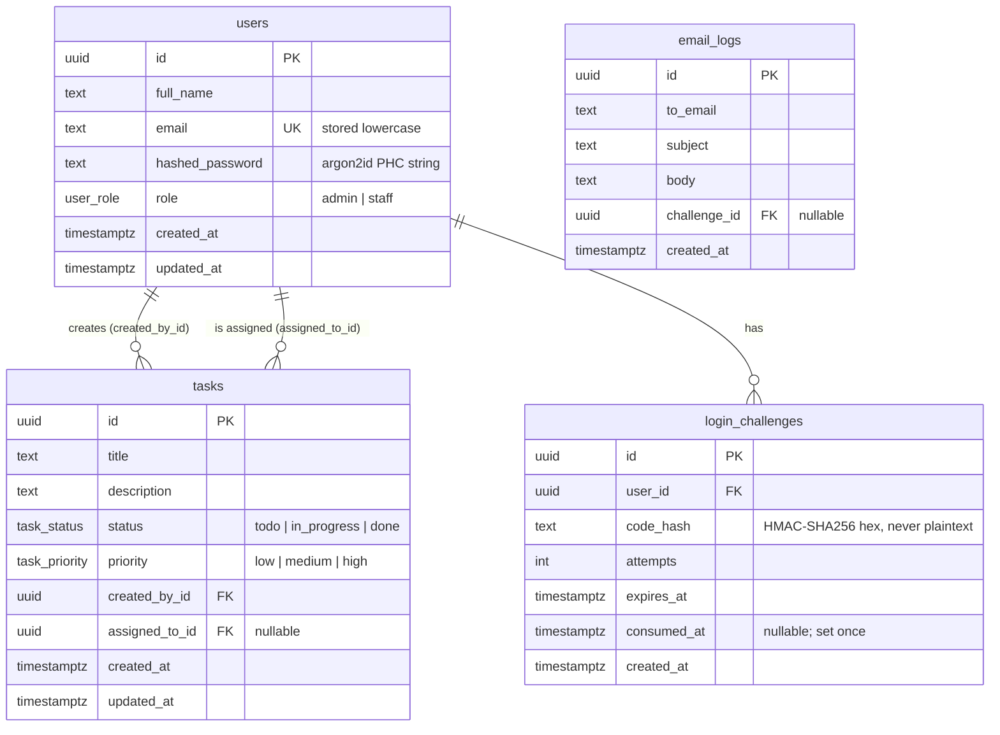

# 3. Data Model

## ER diagram



## Migrations

### `20261006000001_create_enums_and_users.sql`

```sql
CREATE TYPE user_role     AS ENUM ('admin', 'staff');
CREATE TYPE task_status   AS ENUM ('todo', 'in_progress', 'done');
CREATE TYPE task_priority AS ENUM ('low', 'medium', 'high');

CREATE TABLE users (
    id              UUID PRIMARY KEY DEFAULT gen_random_uuid(),
    full_name       TEXT        NOT NULL CHECK (length(full_name) BETWEEN 1 AND 120),
    email           TEXT        NOT NULL UNIQUE CHECK (email = lower(email)),
    hashed_password TEXT        NOT NULL,
    role            user_role   NOT NULL DEFAULT 'staff',
    created_at      TIMESTAMPTZ NOT NULL DEFAULT now(),
    updated_at      TIMESTAMPTZ NOT NULL DEFAULT now()
);
```

### `20261006000002_create_tasks.sql`

```sql
CREATE TABLE tasks (
    id             UUID PRIMARY KEY DEFAULT gen_random_uuid(),
    title          TEXT          NOT NULL CHECK (length(title) BETWEEN 1 AND 200),
    description    TEXT          NOT NULL DEFAULT '',
    status         task_status   NOT NULL DEFAULT 'todo',
    priority       task_priority NOT NULL DEFAULT 'medium',
    created_by_id  UUID          NOT NULL REFERENCES users(id),
    assigned_to_id UUID          NULL     REFERENCES users(id),
    created_at     TIMESTAMPTZ   NOT NULL DEFAULT now(),
    updated_at     TIMESTAMPTZ   NOT NULL DEFAULT now()
);
CREATE INDEX idx_tasks_assigned_to ON tasks(assigned_to_id);
```

### `20261006000003_create_login_challenges_and_email_logs.sql`

```sql
CREATE TABLE login_challenges (
    id          UUID PRIMARY KEY DEFAULT gen_random_uuid(),
    user_id     UUID        NOT NULL REFERENCES users(id) ON DELETE CASCADE,
    code_hash   TEXT        NOT NULL,
    attempts    INT         NOT NULL DEFAULT 0,
    expires_at  TIMESTAMPTZ NOT NULL,
    consumed_at TIMESTAMPTZ NULL,
    created_at  TIMESTAMPTZ NOT NULL DEFAULT now()
);
CREATE INDEX idx_login_challenges_user ON login_challenges(user_id);

CREATE TABLE email_logs (
    id           UUID PRIMARY KEY DEFAULT gen_random_uuid(),
    to_email     TEXT        NOT NULL,
    subject      TEXT        NOT NULL,
    body         TEXT        NOT NULL,
    challenge_id UUID        NULL REFERENCES login_challenges(id) ON DELETE SET NULL,
    created_at   TIMESTAMPTZ NOT NULL DEFAULT now()
);
CREATE INDEX idx_email_logs_created ON email_logs(created_at DESC);
```

`gen_random_uuid()` is built into Postgres 13+, so no extension is needed. The application sets `updated_at = now()` explicitly in each `UPDATE`. That keeps the SQL visible in the code and avoids hidden triggers.

## Rust domain types

```rust
#[derive(sqlx::Type, Serialize, Deserialize, Clone, Copy, PartialEq, Eq, ToSchema)]
#[sqlx(type_name = "user_role", rename_all = "snake_case")]
#[serde(rename_all = "snake_case")]
pub enum Role { Admin, Staff }

// TaskStatus { Todo, InProgress, Done }   -> "todo" | "in_progress" | "done"
// TaskPriority { Low, Medium, High }      -> "low" | "medium" | "high"
```

Row structs (`UserRow`, `TaskRow`) derive `FromRow` and stay inside the repository and service layers. Handlers only ever serialize **DTOs**. For example, `TaskDto.assigned_to` is the assignee's **email**, as the expected response shows. The repository produces it with a `LEFT JOIN users`.

## Design notes

- **Email is the user identity in the API** (`assigned_to: "jamesbond@example.com"`). Internally all foreign keys are UUIDs.
- **Why `email_logs` holds the code in its body:** this table stands in for a real inbox. It is the email itself, not the verification record. The verification record (`login_challenges`) stores only a keyed hash. The table and its read endpoint exist only when `APP_ENV=development`. *(This trade-off is listed in [open decisions](09-implementation-plan.md#open-decisions).)*
- **Ordering of `view-my-tasks`:** by priority (high → low), then `created_at`. This matches the expected response, which lists high, medium, then low.
