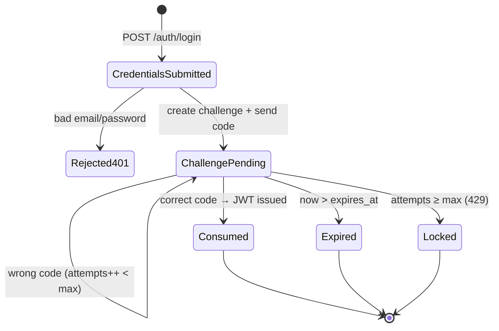

# 5. Auth, 2FA & Security

## Login state machine



## Step 1: `POST /auth/login`

1. Normalize the email (trim, lowercase) and load the user.
2. Verify the password with Argon2id (`PasswordHash::new` + `Argon2::verify_password`). **If the user doesn't exist, verify against a dummy hash anyway** so both failure paths take about the same time and the API doesn't reveal which emails exist.
3. Invalidate any earlier pending challenges for this user by setting `consumed_at = now()`, so only the newest code works.
4. Generate a 6-digit code with `rand::rngs::OsRng` (uniform in `000000–999999`, zero-padded).
5. Store `code_hash = hex(HMAC_SHA256(OTP_SECRET, challenge_id || ":" || code))` and `expires_at = now() + 300s`.
6. `Mailer::send_verification(user.email, code, challenge_id)`. The `DevMailer` inserts an `email_logs` row and logs:
   `INFO 2FA code for admin@example.com: 482913 (challenge 9d1c…)`
7. Return `{ login_challenge_id, expires_in_seconds }`. **No token.**

### Why HMAC and not Argon2 for the code

A 6-digit code has only 10⁶ possibilities. A slow hash like Argon2 doesn't protect it, because an attacker holding a leaked DB could brute-force a million Argon2 hashes anyway. What protects it is a **secret key the DB doesn't contain**: without `OTP_SECRET`, a leaked `code_hash` is useless. Online guessing is stopped separately by the 5-minute expiry and the 5-attempt limit. Binding `challenge_id` into the MAC means a hash can't be replayed against a different challenge.

## Step 2: `POST /auth/verify-2fa`

Everything runs in **one transaction** with `SELECT … FOR UPDATE` on the challenge row, so two concurrent requests can't both consume it:

| Check (in order) | Failure |
|---|---|
| Challenge exists | 401 `invalid_code` (same message as a wrong code) |
| `consumed_at IS NULL` | 401 `code_already_used` |
| `expires_at > now()` | 401 `code_expired` |
| `attempts < OTP_MAX_ATTEMPTS` | 429 `too_many_attempts` |
| Constant-time compare of the HMAC (`hmac::Mac::verify_slice`) | `attempts += 1`, commit, then 401 `invalid_code` |
| ✅ | `consumed_at = now()`, commit, issue the JWT |

This covers every rule in the brief: codes expire after 5 minutes, work only once, wrong and expired codes are rejected, and the JWT is issued only after verification.

## JWT

- HS256, signed with `JWT_SECRET`, with a 60-minute lifetime.
- Claims:

```json
{ "sub": "<user uuid>", "email": "jamesbond@example.com", "role": "staff",
  "iat": 1760000000, "exp": 1760003600, "iss": "task-api" }
```

- The `jsonwebtoken::Validation` checks `exp` (with no leeway), `iss`, and the algorithm.

## Role-based access (RBAC)

The check lives in **extractors**, so it is declared in each handler's signature and can't be forgotten inside the handler body:

```rust
pub struct AuthUser { pub id: Uuid, pub email: String, pub role: Role }

impl<S> FromRequestParts<S> for AuthUser { /* Bearer → decode → 401 on failure */ }

pub struct AdminUser(pub AuthUser);
impl<S> FromRequestParts<S> for AdminUser {
    // AuthUser first, then: role != Admin → AppError::Forbidden("Only admins can …")
}

async fn create_task(State(s): State<AppState>, AdminUser(admin): AdminUser,
                     Json(body): Json<CreateTaskRequest>) -> Result<(StatusCode, Json<TaskDto>), AppError>
```

| Action | admin | staff |
|---|---|---|
| Create task | ✅ | ❌ 403 |
| Assign tasks | ✅ | ❌ 403 |
| List all tasks / users | ✅ | ❌ 403 |
| Update any task field | ✅ | ❌ 403 |
| Update `status` of own assigned task | ✅ | ✅ |
| View my tasks | ✅ (own) | ✅ (own only) |

`view-my-tasks` filters with `WHERE assigned_to_id = $auth_user_id`, using the ID from the verified token. The client can't pass a user ID, so James can only ever see his own tasks.

**Role source:** the role is read from the signed token. Role changes therefore take effect when the user next logs in, which is at most 60 minutes later. This is acceptable for this scope and documented.

## Other security measures

- Passwords are never logged or returned. `UserRow` doesn't derive `Serialize`.
- CORS allows only `CORS_ORIGIN`.
- The seed and dev routes aren't mounted outside development.
- Request bodies are size-limited with `DefaultBodyLimit`.
- Secrets come only from the environment. `.env` is git-ignored, and only `.env.example` is committed.
- The frontend keeps the token in `sessionStorage`, which is cleared when the tab closes. This trade-off against `httpOnly` cookies is documented in [07](07-frontend.md).
