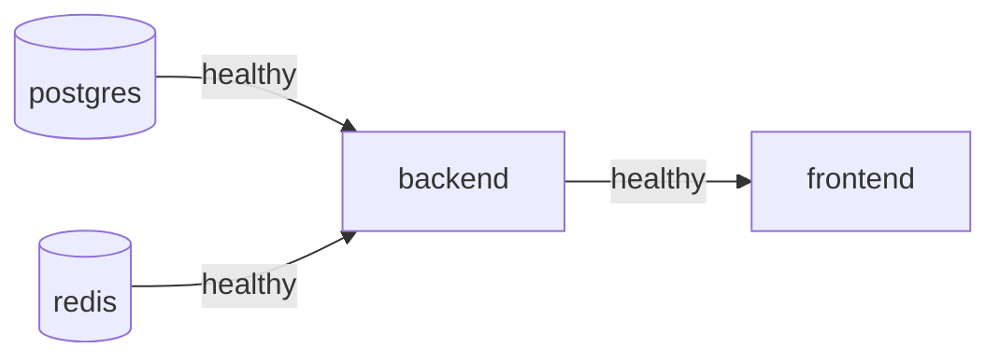

# 10. Docker: One Command Runs Everything

```bash
cp .env.example .env
docker compose up --build
```

This single command starts **all four services**. Migrations run automatically when the backend starts.

| Service | Image | Host URL | Purpose |
|---|---|---|---|
| `postgres` | `postgres:16-alpine` | `localhost:5432` | Database (port exposed so `cargo test` and `sqlx-cli` can reach it from the host) |
| `redis` | `redis:7-alpine` | `localhost:6379` | Per-user task cache |
| `backend` | built from `backend/Dockerfile` | `http://localhost:8080`, Swagger at `/swagger-ui` | Rust API |
| `frontend` | built from `frontend/Dockerfile` | `http://localhost:5173` | React app served by nginx |

## Startup order



- `postgres` is healthy when `pg_isready` succeeds, and `redis` when `redis-cli ping` succeeds.
- `backend` waits for both, runs `sqlx::migrate!` (migrations are embedded in the binary), then serves. It is healthy when `GET /health` returns 200.
- `frontend` waits for `backend` to be healthy.

## `docker-compose.yml` (created in Phase 0)

```yaml
name: task-manager

services:
  postgres:
    image: postgres:16-alpine
    environment:
      POSTGRES_USER: ${POSTGRES_USER:-taskapp}
      POSTGRES_PASSWORD: ${POSTGRES_PASSWORD:-taskapp}
      POSTGRES_DB: ${POSTGRES_DB:-taskapp}
    ports:
      - "5432:5432"
    volumes:
      - pgdata:/var/lib/postgresql/data
    healthcheck:
      test: ["CMD-SHELL", "pg_isready -U ${POSTGRES_USER:-taskapp} -d ${POSTGRES_DB:-taskapp}"]
      interval: 5s
      timeout: 3s
      retries: 10

  redis:
    image: redis:7-alpine
    ports:
      - "6379:6379"
    healthcheck:
      test: ["CMD", "redis-cli", "ping"]
      interval: 5s
      timeout: 3s
      retries: 10

  backend:
    build: ./backend
    env_file: .env
    environment:
      # container-network overrides (the .env values point at localhost for native runs)
      BIND_ADDR: 0.0.0.0:8080
      DATABASE_URL: postgres://${POSTGRES_USER:-taskapp}:${POSTGRES_PASSWORD:-taskapp}@postgres:5432/${POSTGRES_DB:-taskapp}
      REDIS_URL: redis://redis:6379
      CACHE_BACKEND: redis
      CORS_ORIGIN: http://localhost:5173
    ports:
      - "8080:8080"
    depends_on:
      postgres: { condition: service_healthy }
      redis: { condition: service_healthy }
    healthcheck:
      test: ["CMD", "curl", "-fsS", "http://localhost:8080/health"]
      interval: 5s
      timeout: 3s
      retries: 20

  frontend:
    build:
      context: ./frontend
      args:
        VITE_API_BASE_URL: http://localhost:8080   # the browser calls the API on the host port
    ports:
      - "5173:80"
    depends_on:
      backend: { condition: service_healthy }

volumes:
  pgdata:
```

## `backend/Dockerfile` (multi-stage, with dependency caching)

```dockerfile
FROM rust:1-slim-bookworm AS chef
RUN cargo install cargo-chef --locked
WORKDIR /app

FROM chef AS planner
COPY . .
RUN cargo chef prepare --recipe-path recipe.json

FROM chef AS builder
COPY --from=planner /app/recipe.json recipe.json
RUN cargo chef cook --release --recipe-path recipe.json   # cached unless dependencies change
COPY . .
RUN cargo build --release --bin task-api

FROM debian:bookworm-slim AS runtime
RUN apt-get update && apt-get install -y --no-install-recommends ca-certificates curl \
    && rm -rf /var/lib/apt/lists/*
RUN useradd -r -u 10001 app
COPY --from=builder /app/target/release/task-api /usr/local/bin/task-api
USER app
EXPOSE 8080
CMD ["task-api"]
```

The build uses `rustls` throughout (SQLx, Redis), so the runtime image needs no OpenSSL. It runs as a non-root user.

## `frontend/Dockerfile` (build, then serve with nginx)

```dockerfile
FROM node:22-alpine AS build
WORKDIR /app
COPY package.json package-lock.json ./
RUN npm ci
COPY . .
ARG VITE_API_BASE_URL=http://localhost:8080
ENV VITE_API_BASE_URL=$VITE_API_BASE_URL
RUN npm run build

FROM nginx:1.27-alpine
COPY nginx.conf /etc/nginx/conf.d/default.conf
COPY --from=build /app/dist /usr/share/nginx/html
EXPOSE 80
```

`frontend/nginx.conf` adds the single-page-app fallback, so reloading `/my-tasks` doesn't return a 404:

```nginx
server {
  listen 80;
  root /usr/share/nginx/html;
  location / { try_files $uri /index.html; }
}
```

Vite bakes `VITE_*` variables in at **build time**. That's why the API URL is a build arg and not a runtime environment variable.

## Common commands

| Goal | Command |
|---|---|
| Start everything | `docker compose up --build` (add `-d` to run in the background) |
| Watch 2FA codes in the console | `docker compose logs -f backend` |
| Stop | `docker compose down` |
| Stop and wipe the DB | `docker compose down -v` |
| Only the DB and cache (for native `cargo run` / `npm run dev`) | `docker compose up -d postgres redis` |
| Run backend tests | `docker compose up -d postgres` then `cd backend && cargo test` |

## Files added by this

```
backend/Dockerfile
backend/.dockerignore      # target/, .env
frontend/Dockerfile
frontend/nginx.conf
frontend/.dockerignore     # node_modules/, dist/, .env
docker-compose.yml
```

## Two ways to run

Both are documented in the README:

1. **Docker (recommended for reviewers):** `docker compose up --build` runs all four services.
2. **Native (for development):** `docker compose up -d postgres redis`, then `cargo run` in `backend/` and `npm run dev` in `frontend/`. This gives hot reload.
