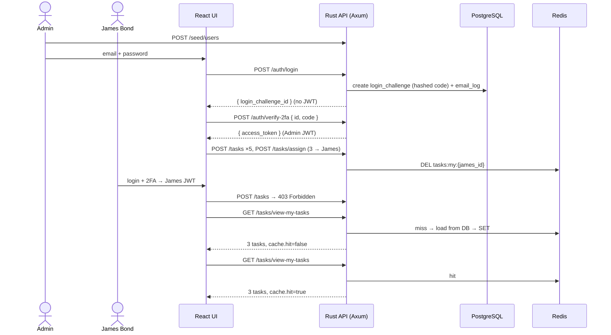

# Task Management App — Design Docs

Design documentation for the Full Stack Rust assignment: a task manager with a Rust API, email-based 2FA, JWT auth, role-based access, per-user caching, and a React frontend.

**Status:** Draft. Implementation starts after approval.

| # | Document | What it covers |
|---|----------|----------------|
| 1 | [Overview & Tech Stack](01-overview.md) | Goals, scope, technology choices and why |
| 2 | [System Architecture](02-architecture.md) | Components, request flow, backend layers, repo layout |
| 3 | [Data Model](03-data-model.md) | Tables, enums, constraints, migrations |
| 4 | [API Specification](04-api-spec.md) | Every endpoint, request/response bodies, error format |
| 5 | [Auth, 2FA & Security](05-auth-and-2fa.md) | Password hashing, 2FA challenge, JWT, RBAC |
| 6 | [Caching](06-caching.md) | Per-user cache for `view-my-tasks`, invalidation |
| 7 | [Frontend](07-frontend.md) | React structure, screens, state, API layer |
| 8 | [Testing Strategy](08-testing.md) | Backend integration tests, frontend tests, mapping to requirements |
| 9 | [Implementation Plan](09-implementation-plan.md) | Build phases, validation script, deliverables, **open decisions** |
| 10 | [Docker](10-docker.md) | `docker compose up --build` runs Postgres, Redis, backend and frontend together |

## The core flow in one picture

